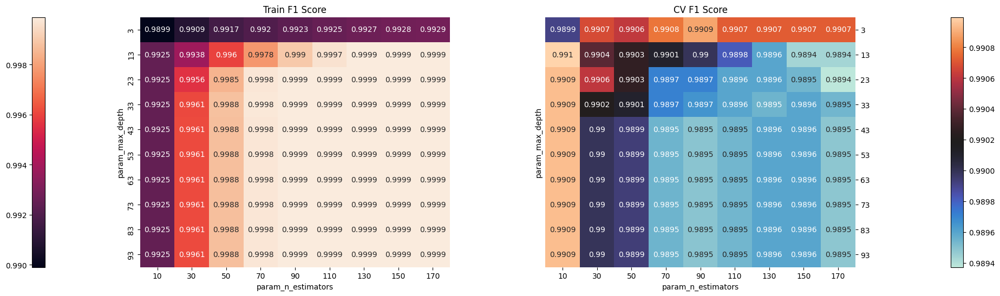
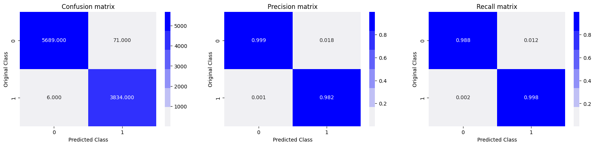
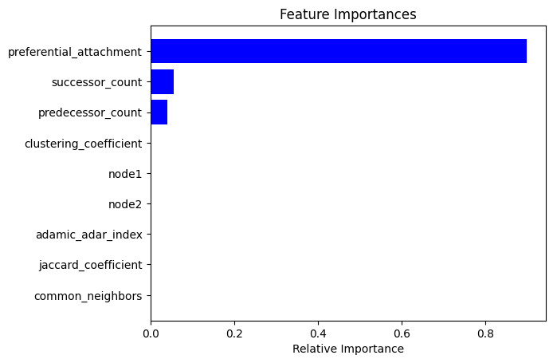

<b>HW1 – Link Prediction</b>

### Description

This assignment is to predict whether a node pair (node1, node2) has hidden relation (i.e., hidden edge). There are about 32,000 edges provided for you to reconstruct the social network and the training dataset. This is a directed network, so each node pair represents a directed edge. E.g., (32869, 24548, 0) represents node 32869 to node 24548 have no edge, while (29237, 16563, 1) represents an edge from node 29237 to node 16563. 
    
Testing dataset includes 8,000 node pairs whose labels are 0 or 1. These are the relationships you are asked to predict. You can use any prediction method, and you can use any functions/libraries/packages directly. However, even if you use the existing packages, please do understand the method you use and briefly describe it in your report. The result should be uploaded to the Kaggle platform for evaluation. You also need to upload the program files and the report document to Moodle. In your report, please briefly describe the algorithm you use, and provide instructions about how to execute your program.

### Method

1. Read training and testing files with `pandas` as dataframes

1. Create directed graph by training data with `networkx`

1. Diversify training features (append them to training dataframe)

1. Take XGBoost classifier and use `GridSearchCV` to cross-validate with 2 parameters, max_depth and n_estimators (Fig.1)

1. Take the best parameters (max_depth=13, n_estimators=10) to train a XGBoost classifier

1. Split training data as 7:3

1. Prediction and observe confusion matrix and feature importances

1. Check confusion matrix (Fig. 2, 3) if the result is good enough

1. Check the feature importances (Fig. 4), and determine if adding / removing features

1. Predict testing data and export as submission.csv

Fig.1 GridSearchCV

Fig.2 Training confusion matrix

Fig.3 Testing confusion matrix

    

Fig.4 Feature Importances about training data

### Algorithm

1. Load the training data

1. Classify the training data with SVC, Random Forest, K-Neighbors and XGBoost without data pre-processing, all accuracies of the results are around 0.6

1. Try to diversify the training data features

	1. Creating directed graph
	1. Find the node counts before node1
	1. Find the node counts after node2
	1. Find the counts of common neighbor of node1 and node2
	1. Find the Jaccard coefficient
	1. Find the Adamic-Adar index
	1. Find the preferential attachment
	1. Find the clustering coefficient

1. Append all features into training data

1. Cross-validate model training parameters with GridSearchCV

1. Train a model with XGBoost with best parameters for classification

1. Prediction

